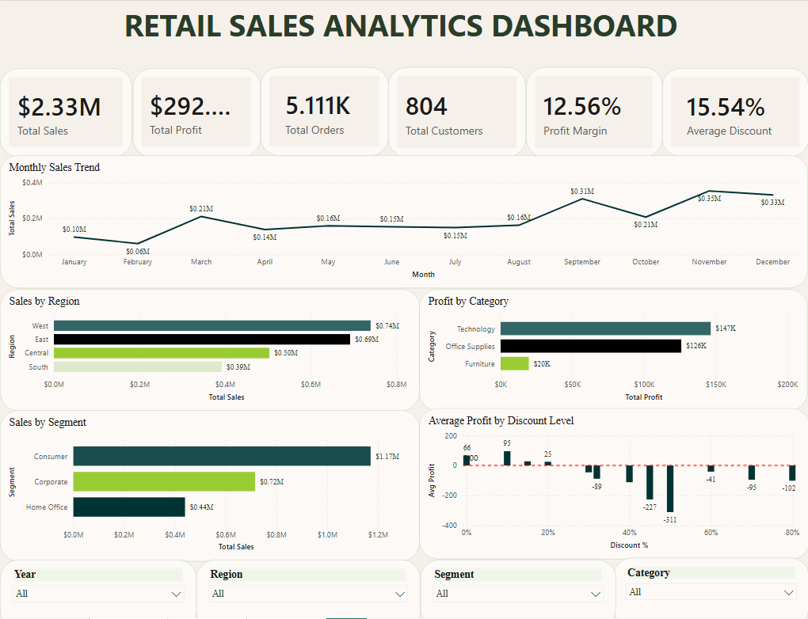
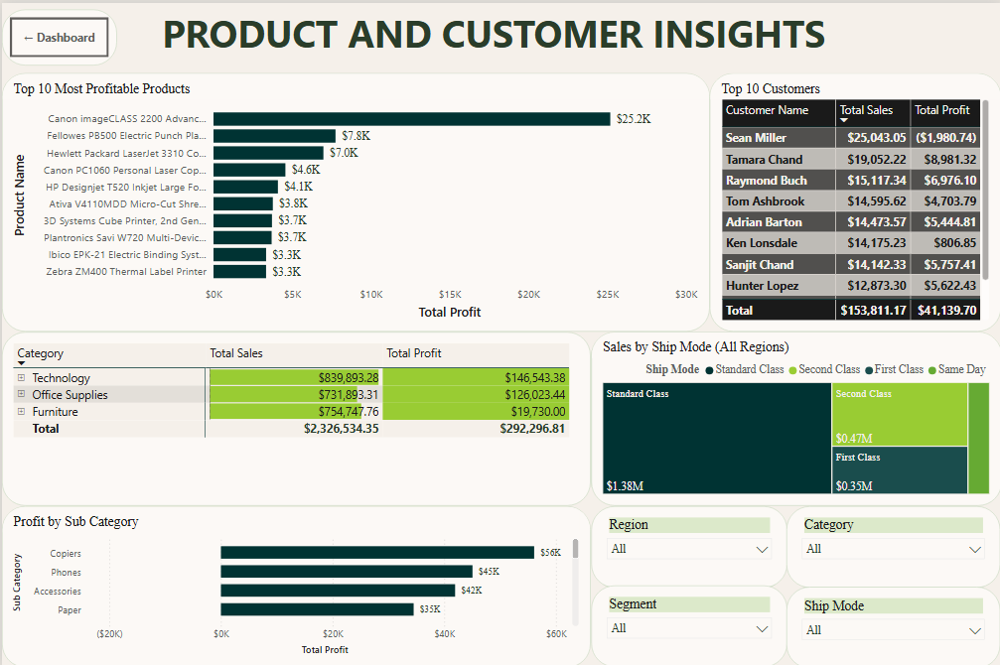
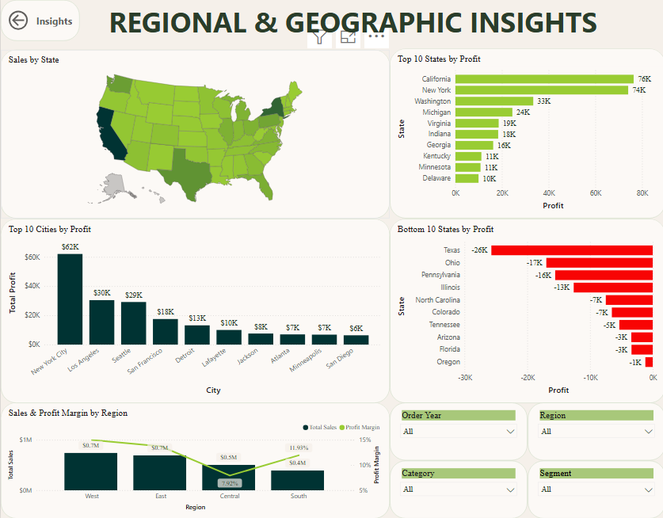

# 📊 Retail Sales Analytics

> **An end-to-end Data Analytics project demonstrating data cleaning, exploratory analysis, SQL-based business analytics, and interactive Power BI dashboards.**


</p>

---

## 📊 Dashboard Preview

### Executive Dashboard



### Product & Customer Insights



### Regional & Geographic Insights



---


---

## 📑 Table of Contents

- Project Overview
- Tech Stack
- Dataset
- Workflow
- Dashboard
- Key Insights
- Folder Structure
- Installation
- Future Improvements

---

##  Project Overview

This project analyzes a retail sales dataset containing over **10,000 transactions** to uncover business trends, customer behavior, regional performance, product profitability, and the impact of discount strategies.

The project follows a structured analytics pipeline covering data cleaning, feature engineering, exploratory analysis, SQL-based business analytics, and interactive dashboard development.

---
## ✨ Project Highlights

- End-to-end analytics pipeline
- 10,194 retail transactions analyzed
- Python-based data cleaning & feature engineering
- 50+ SQL business queries
- Interactive 3-page Power BI dashboard
- Business recommendations backed by data

---

##  Business Objectives

The analysis aims to answer key business questions such as:

- Which regions generate the highest sales and profits?
- Which products contribute the most to profitability?
- Which products consistently incur losses?
- How do discounts affect profitability?
- Who are the most valuable customers?
- What insights can improve business performance?

---

##  Tech Stack

- Python
- Pandas
- NumPy
- Matplotlib
- MySQL
- SQL
- Power BI
- Git & GitHub
- Jupyter Notebook

---

##  Dataset

**Dataset:** Sample Superstore

- **Rows:** 10,194
- **Columns:** 21

Key fields include:

- Order Date
- Ship Date
- Region
- Category
- Sub-Category
- Customer
- Sales
- Quantity
- Discount
- Profit

---

# Project Workflow

```
Raw Data
    │
    ▼
Data Understanding
    │
    ▼
Data Cleaning
    │
    ▼
Feature Engineering
    │
    ▼
Exploratory Data Analysis
    │
    ▼
SQL Business Analytics
    │
    ▼
Power BI Dashboard
    │
    ▼
Business Insights & Recommendations
```

---

# Project Structure

```
Retail-Sales-Analytics
│
├── data
│   ├── raw
│   └── cleaned
│
├── notebooks
│   ├── 01_data_understanding.ipynb
│   ├── 02_data_cleaning.ipynb
│   └── 03_eda.ipynb
│
├── sql
│   ├── 01_database_setup.sql
│   ├── 02_basic_queries.sql
│   ├── 03_aggregation.sql
│   ├── 04_business_analysis.sql
│   ├── 05_advanced_sql.sql
│   └── 06_interview_queries.sql
│
├── dashboard
│
├── images
│
├── requirements.txt
└── README.md
```

---

# Data Cleaning

The dataset was cleaned using Pandas by:

- Standardizing column names
- Converting all columns to snake_case
- Handling inconsistent formats
- Exporting a cleaned dataset for downstream analysis

---

# Feature Engineering

Additional business-oriented features were created:

- Order Year
- Order Month
- Order Month Number
- Order Day
- Shipping Days
- Profit Margin

---

# Exploratory Data Analysis

Comprehensive business analysis was performed on:

- Business KPIs
- Sales Trends
- Regional Performance
- Category Performance
- Sub-Category Analysis
- Product Profitability
- Customer Analysis
- Pareto Analysis
- Purchase Frequency
- Discount Analysis
- Shipping Performance

---

# SQL Analytics

Business-oriented SQL analysis includes:

- Data Exploration
- Aggregation
- Business KPIs
- Customer Analysis
- Product Analysis
- Regional Analysis
- Discount Analysis
- Time-Based Analysis
- Advanced SQL Queries
- Window Functions
- CTEs
- Subqueries

---

# Power BI Dashboard

Interactive dashboard includes:

- Executive KPI Cards
- Sales Trends
- Profit Trends
- Regional Performance
- Category Analysis
- Customer Insights
- Discount Impact
- Interactive Filters

---

# Key Business Insights

Some major insights obtained from the analysis include:

- Technology is the most profitable product category.
- Copiers generate the highest profits among all sub-categories.
- Tables and Bookcases consistently incur losses.
- High discounts significantly reduce profitability.
- Customer value extends beyond revenue and should include profit contribution and purchase frequency.
- Shipping time has minimal impact on overall profitability.

---

# Business Recommendations

- Review pricing strategy for loss-making products.
- Restrict excessive discounting.
- Focus marketing efforts on high-value customers.
- Increase investment in profitable product categories.
- Monitor regional performance for resource allocation.

---

# Skills Demonstrated

- Data Cleaning
- Data Wrangling
- Feature Engineering
- Exploratory Data Analysis
- Business Analytics
- SQL
- Data Visualization
- Dashboard Development
- Business Storytelling
- Git & GitHub

---

# Future Improvements

- Predictive Sales Forecasting
- Customer Segmentation
- RFM Analysis
- Inventory Analytics
- Time-Series Forecasting
- Machine Learning Models

---

##  Author

**Manish Kumar Gupta**

Electronics & Communication Engineering  
Birla Institute of Technology, Mesra

- GitHub: https://github.com/Manish-OG
- LinkedIn: https://www.linkedin.com/in/manish-kumar-gupta-b63863327?utm_source=share_via&utm_content=profile&utm_medium=member_android
- Email: gupta.manish2027@gmail.com